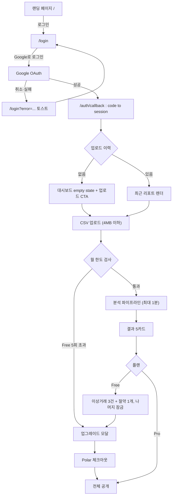
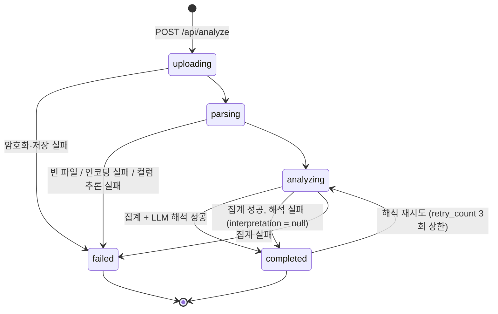
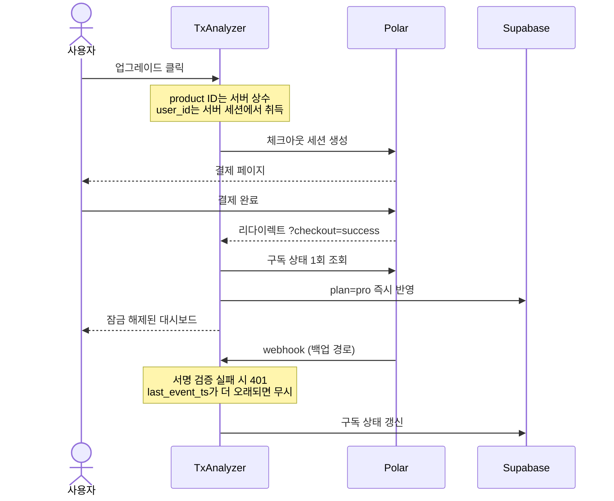

# 사용자 여정

## 1. 전체 여정

## 2. 업로드 · 분석 상태 머신

`csv_uploads.status`의 전이. 상태값은 `uploading | parsing | analyzing | completed | failed` 다섯 개뿐이다.

**부분 실패**: LLM 해석이 실패해도 코드 집계 결과는 이미 존재하므로 `completed` + `interpretation: null`로 저장한다. 카테고리·추이 카드는 정상 렌더하고 해석 카드에만 재시도 버튼을 노출한다. 별도 상태값을 만들지 않는다.

**좀비 방지**: `analyzing`으로 10분 이상 머문 업로드는 조회 시점에 실패로 간주한다(사용자가 탭을 닫아 요청이 끊긴 경우).

## 3. 결제 시퀀스

## 4. 핵심 여정 요약

1. **신규**: 랜딩 → Google OAuth → 대시보드 empty state → 업로드 → 결과 5카드(Pro 2종은 티저) → 업그레이드
2. **재방문**: 세션이 있으면 대시보드 직행 → 히스토리 조회 또는 새 업로드
3. **업그레이드**: 체크아웃 → Polar → 복귀 시 즉시 반영 → 잠금 해제
4. **해지**: Polar 포털 → 그레이스 기간 배너(주기 종료일 표시) → 종료 시 Free 전환

## 5. 엣지 케이스 처리

| 시나리오 | 처리 |
|---|---|
| 비CSV / 4MB 초과 / 행 50,000·컬럼 50 초과 | 클라이언트 또는 파싱 단계에서 차단 |
| 빈 파일 / EUC-KR 인코딩 실패 / 컬럼 추론 실패 | `failed` + 사유별 안내, 재업로드 유도 |
| 일부 행 금액 파싱 실패 | 해당 행 스킵 + "N행을 읽지 못했습니다" 표시 |
| LLM 해석 실패 | `interpretation: null` → 집계 카드는 렌더, 해석 카드만 재시도 |
| Free 월 한도 초과 | `upload_limit_reached` → 업그레이드 모달 |
| 재시도 4회째 | `retry_limit_exceeded` |
| Free의 Pro 데이터 접근 | 서버 응답에서 필드 자체를 제외 |
| 타 사용자 리포트 접근 | RLS + service role 경로의 명시적 소유권 검사 |
| OAuth 취소·실패 | `/login?error=...` 토스트 |
| 외부 redirect 시도 | `/`로 시작하는 상대 경로만 허용 |
| 결제 중 이탈 | cancel 배너, 구독 상태 불변 |
| webhook 지연·유실 | 복귀 시 Polar 직접 조회로 이미 반영됨 |
| webhook 순서 역전 | `last_event_ts` 비교 후 오래된 이벤트 무시 |
| 위조 webhook | 서명 검증 실패 → 401 |
| 분석 중 탭 이탈 | 서버 작업은 계속되고 결과는 DB에 남아 재방문 시 복구 |
| 세션 만료 | 미들웨어 갱신 시도 → 실패 시 401 → 로그인 후 원래 화면 복귀 |
| 다운그레이드 | 12개월 초과 데이터·Pro 카드 재잠금 (데이터는 보존) |
| 계정 삭제 | 구독 취소 → Storage 원본 삭제 → DB row 삭제 → Auth 사용자 삭제 |
