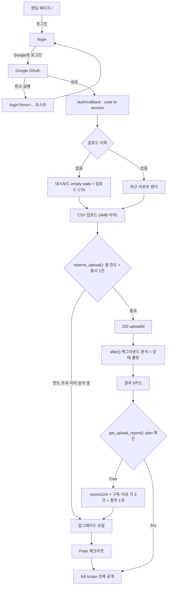
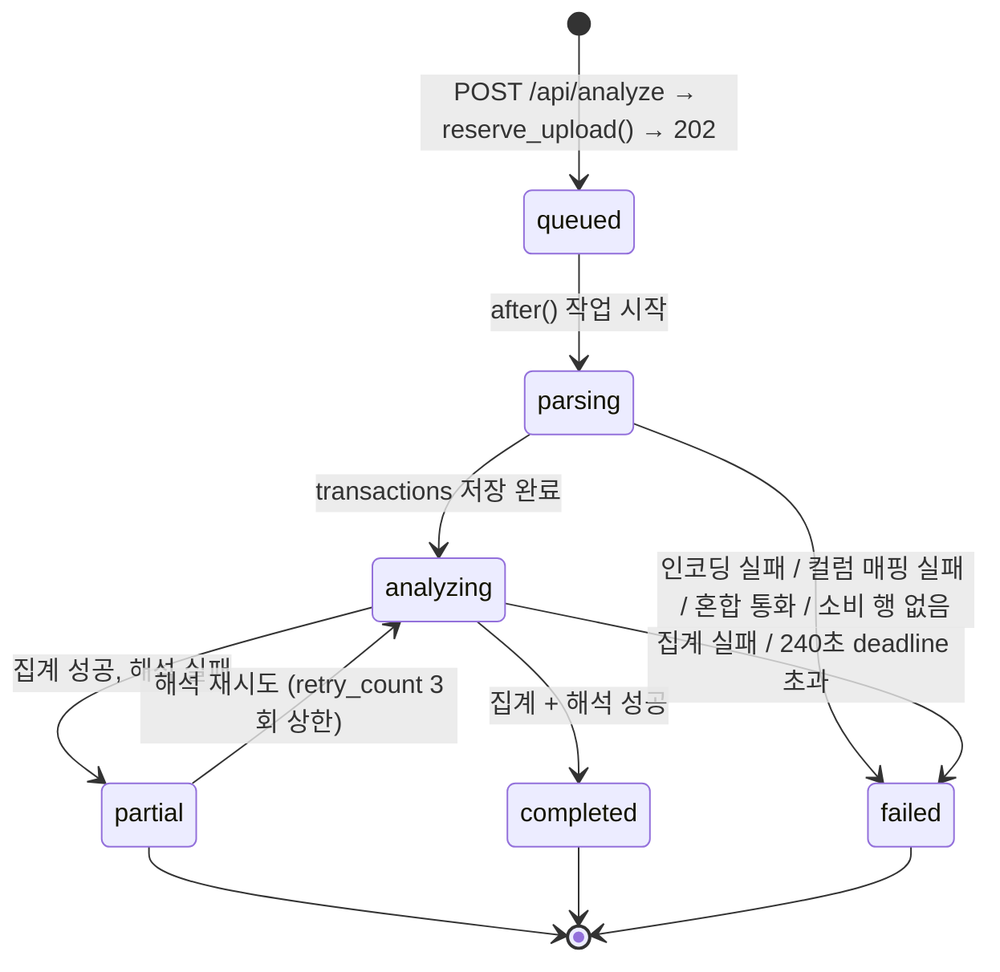
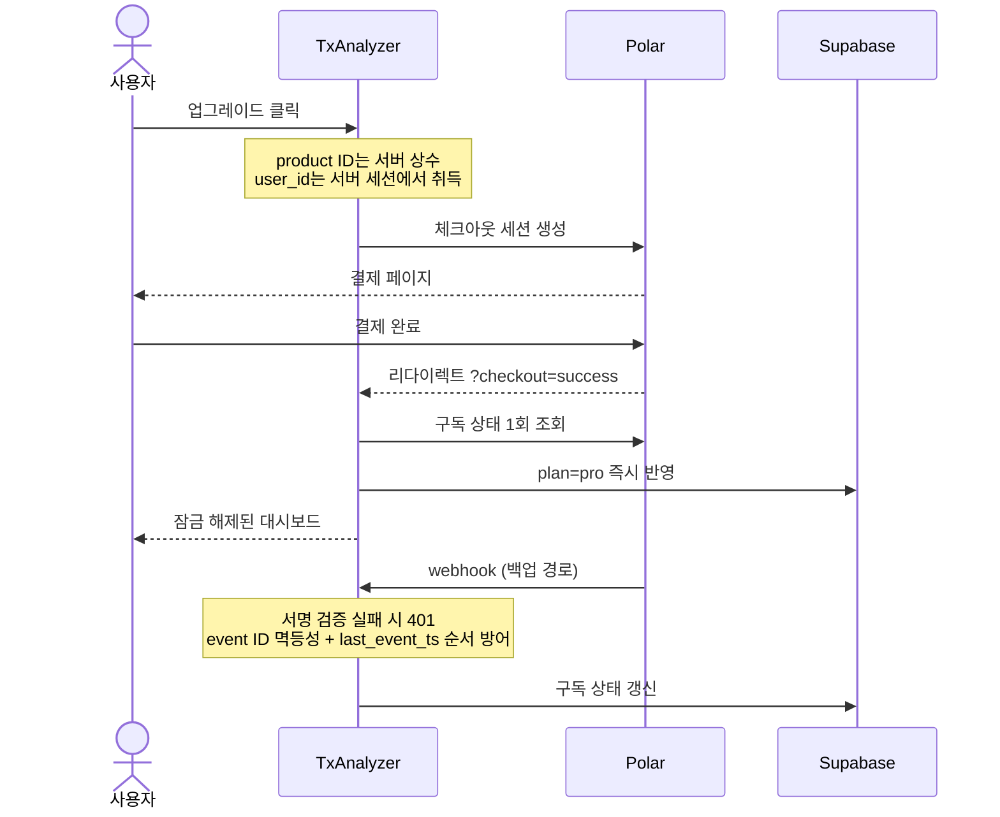

# 사용자 여정

## 1. 전체 여정

## 2. 업로드 · 분석 상태 머신

`csv_uploads.status`의 전이. 상태값은 `queued | parsing | analyzing | partial | completed | failed` 여섯 개다.

**부분 실패는 별도 상태값이다.** LLM 해석이 실패해도 코드 집계는 이미 존재하므로 `partial`로 저장한다. 카테고리·추이 카드는 정상 렌더하고 해석 카드에만 재시도 버튼을 노출한다.

**재시도 범위**: 재시도는 저장된 `transactions`를 재사용해 분류·해석만 다시 돌린다. 원본 CSV를 보관하지 않으므로 **파싱 전 실패(`parsing → failed`)는 재시도할 수 없고 재업로드해야 한다.**

**좀비 방지**: `queued|parsing|analyzing`으로 10분 이상 머문 업로드는 조회 시점에 `mark_stale_upload()`가 `failed` + `analysis_timeout`으로 전환한다(사용자가 탭을 닫아 작업이 끊긴 경우).

## 3. 결제 시퀀스

## 4. 핵심 여정 요약

1. **신규**: 랜딩 → Google OAuth → 대시보드 empty state → 업로드 → 결과 5카드(Pro 2종은 티저) → 업그레이드
2. **재방문**: 세션이 있으면 대시보드 직행 → 히스토리 조회 또는 새 업로드
3. **업그레이드**: 체크아웃 → Polar → 복귀 시 즉시 반영 → 잠금 해제
4. **해지**: Polar 포털 → 그레이스 기간 배너(주기 종료일 표시) → 종료 시 Free 전환

## 5. 엣지 케이스 처리

| 시나리오 | 처리 |
|---|---|
| 비CSV / 4MB 초과 / 빈 파일 / 행 50,000·컬럼 50 초과 | 분석 row 생성 전 거부, 한도 미차감 |
| EUC-KR 인코딩 실패 / 컬럼 매핑 실패 / 혼합 통화 / 소비 행 없음 | `failed` + 사유별 안내. 생성된 row는 한도 차감 |
| 일부 행 파싱 실패 ≤5% | 해당 행 스킵 + `skippedRowCount`로 "N행을 읽지 못했습니다" 표시 |
| 일부 행 파싱 실패 >5% | `parse_failed`로 전체 실패 |
| LLM 분류 batch 일부 실패 | 해당 가맹점 `other` 처리 후 나머지 분석 계속 |
| LLM 해석 실패 | `partial` → 집계 카드는 렌더, 해석 카드만 재시도 |
| Free 월 6번째 / Pro 월 31번째 | `upload_limit_reached` → 업그레이드 모달 |
| 이미 분석 중인 업로드 존재 | `analysis_in_progress` |
| 재시도 4회째 | `retry_limit_exceeded` |
| Free의 Pro 데이터 접근 | `get_upload_report()`가 응답에서 필드 자체를 제외 |
| 타 사용자 리포트 · full payload 직접 접근 | RPC 소유권 검사 + `transactions`·`analysis_results` SELECT 권한 미부여 |
| OAuth 취소·실패 | `/login?error=...` 토스트 |
| 외부 redirect 시도 | `/`로 시작하는 상대 경로만 허용 |
| 결제 중 이탈 | cancel 배너, 구독 상태 불변 |
| webhook 지연·유실 | 복귀 시 Polar 직접 조회로 이미 반영됨 |
| webhook 순서 역전 | `last_event_ts` 비교 후 오래된 이벤트 무시 |
| 위조 webhook | 서명 검증 실패 → 401 |
| 분석 중 탭 이탈 | `after()` 작업이 계속되고 결과는 DB에 남아 재방문 시 복구 |
| 10분 이상 active 상태 | 조회 시 `analysis_timeout`으로 전환 |
| 폴링 2분 초과 | 폴링 중단 + "분석은 계속됩니다. 나중에 다시 확인하세요" |
| 세션 만료 | 미들웨어 갱신 시도 → 실패 시 401 → 로그인 후 원래 화면 복귀 |
| 다운그레이드 | 같은 payload를 보존하고 이후 응답을 `recent12m` + 티저로 재잠금 |
| 계정 삭제 | 구독 취소 → Storage 원본 삭제 → DB row 삭제 → Auth 사용자 삭제 |
